# DES加密算法实现

## DES加密算法原理

### DES介绍

​		DES全称为Data Encryption Standard，即数据加密标准，是一种使用密钥加密的块算法，1977年被美国联邦政府的国家标准局确定为联邦资料处理标准（FIPS），并授权在非密级政府通信中使用，随后该算法在国际上广泛流传开来。

​		DES使用56位的密钥和64位的明文块进行加密。DES算法的分组大小是64位，因此，如果需要加密的明文长度不足64位，需要进行填充；如果明文长度超过64位，则需要使用分组模式进行分组加密。
​		虽然DES算法的分组大小是64位，但是由于DES算法的密钥长度只有56位，因此DES算法存在着弱点，容易受到暴力破解和差分攻击等攻击手段的威胁。因此，在实际应用中，DES算法已经不再被广泛使用，而被更加安全的算法所取代，如AES算法等。
尽管DES已经被取代，但它在密码学的历史上仍然具有重要意义。通过DES可以帮助我们了解对称密钥加密算法的基本概念和运作原理。

### DES加密算法流程

流程图如下：

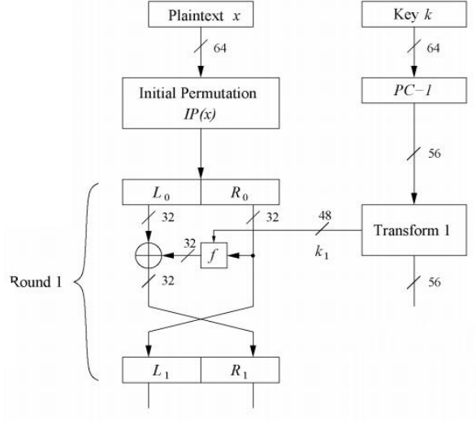 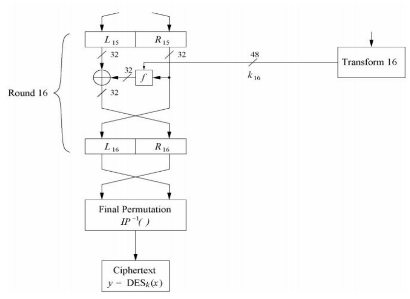

 

大体上可以分为3个阶段：

1. 初始置换 $IP$ ，用于重排明文分组的64比特数据。
2. 经过具有相同功能的16轮Feistel变换，每轮中F函数中都有置换和代换运算，第16轮变换的输出分为左右两半，并被交换次序。
3. 经过一个逆初始置换 $IP^{-1}$ 从而产生64比特的密文。

**1）初次置换(Initial Permutation，IP置换)**

将输入的64位明文块进行置换和重新排列，生成新的64位的数据块。此步骤的目的是为了增加加密的混乱程度，使明文中的每一位都能够对后面的加密过程产生影响，提高加密强度。

将64位的顺序按照下表中规定的顺序进行放置，图中的数字是在64位明文中每个bit的索引位置，如把原来第58个bit放置在第一个位置。	

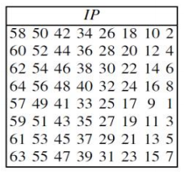 

**2）加密轮次**

初始置换完成后，明文被划分成了相同长度（32位）的左右两部分，记作 $L_0$ 和 $R_0$。接下来进行16个轮次的加密。

每一轮采用Feistel相同的轮结构，将64bit的轮输入分为32bit的左、右两半，分别记为 $L_i$ 和 $R_i$ 。

上一轮次的右半部分$R_{i-1}$会作为当前轮次的左半部分$L_i$的输入。其次，$R_{i-1}$会补位到48位和本轮次生成的48位$k_i$输入到 $F$ 轮函数中去。$F$ 函数的输出结果为32位，结果会和上一轮次的左半部分$L_{i-1}$进行异或运算作为下一轮次右半部分 $R_i$ 的输入：

$L_i = R_{i-1}$

$R_i=L_{i-1}\oplus F(R_{i-1},k_i)$

**3）$F$ 轮函数**

(1) $F$ 函数的示意图如下：

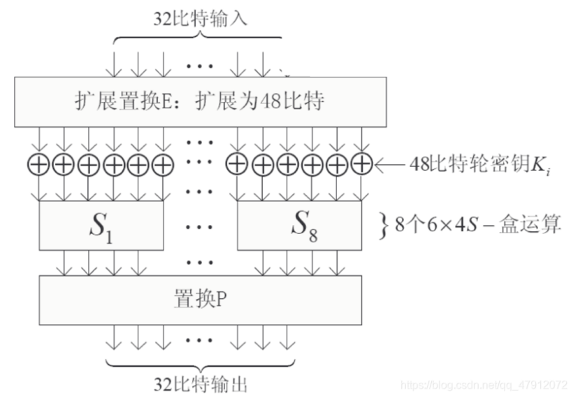 

对右半部分 $R$ 的扩展参照以下置换表：

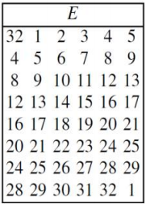 

(2) 子密钥 $k$ 的生成：

DES算法采用了每轮子密钥生成的方式来增加密钥的复杂性和安全性。每轮子密钥都是由主密钥（64位）通过密钥调度算法（Key Schedule Algorithm）生成的。

流程图如下：

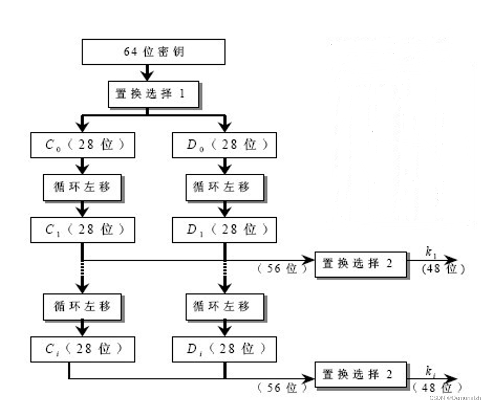 

①将64位主密钥经过置换选择1（Permuted Choice 1简写为 $PC-1$ ）后输出了56位，将其分为左右两个28位的数据块，分别记为 $C_0$ 和 $D_0$ 。同上面我们讲过的置换规则一样，$PC-1$ 置换函数也是一个固定的置换表。

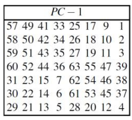 

②对 $C_0$ 和 $D_0$ 进行循环左移操作。循环左移完成后生成 $C_1$ 和 $D_1$ 。因此，在16个轮次的计算当中会得到16个32位的数据块 $C_1-C_{16}$ 和 $D_1-D_{16}$ 。在DES中循环左移也有固定的规则。

对于 $C_i$ 和 $D_i$ ($i=1,2,...,16$)，若 $i=1/2/9/16$ ，则循环左移1位，否则循环左移2位。

③对于 $C_i$ 和 $D_i$ ，将它们经过置换选择2（Permuted Choice 2 简写为$PC-2$）后，得到48位的子密钥$k_i$，用于每轮加密中与输入数据进行异或运算。$PC-2$ 置换的输入是由 $PC-1$ 置换生成的56位的密钥，而它的输出是48位的子密钥。$PC-2$ 置换将56位的密钥重新排列，丢弃了8位并选取了其中的48位作为子密钥。$PC-2$ 的置换规则如下：
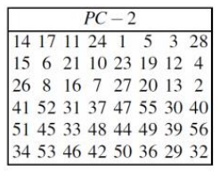 

即 $PC-2$ 置换表的第一行表示选择了输入密钥中的第14、17、11、24、1和5位，并将它们作为输出子密钥的前6位，后面以此类推。最终得到当前轮次的子密钥。

(3)$S$ 盒替换：

将上一轮异或运算的48位结果映射到32位输出中去。

$S$盒也是一种置换表。在DES的每一轮计算中$S$盒都是不一样的。从下图中我们看到，$S$盒内部有8个$S$块，记作$S_1-S_8$。每个$S$块都会接收6位字符作为输入并输出四位字符。以第一个S盒$S_1$为例，它是一个4*16的置换表。

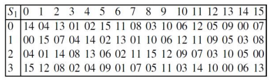 

输入`101110`时，取第一位和最后一位即`10`作为$S_1$的行，中间4位`0111`作为$S_1$的列，转成十进制后即为`(2,7)`，对应表中的第3行第8列，该位置的元素为11，转为4位二进制后为`1011`，故$S(101110)=1011$。

(4)$P$盒置换：

$P$盒替换将$S$盒替换的32位输出作为输入，经过固定的替换表进行替换后即为最后 $F$ 轮函数的结果，替换表如下：

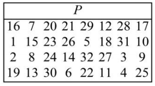 

将当前轮次($i$)的 $F$ 轮函数的结果与上一轮次的左半部分 $L_{i-1}$ 进行异或后即可得到下一轮次的右半部分 $R_i$。

**4）逆置换**

使用下表进行对第16轮的结果进行置换，即可得到DES加密后的结果。

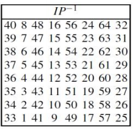 

### 解密原理

流程和使用DES加密基本相同，只是使用子密钥的顺序和加密相反，从第16个子密钥开始。

## 代码实现

### 开发环境与开发工具

操作系统：Windows10

编程语言：Python（版本：Python 3.7.5 - 64bit）

开发工具：Visual Studio Code

### 代码模块介绍

在文件`Tables.py`中，定义了DES加密算法需要用到的各类置换表以及生成子密钥时进行循环左移的位数表，可查看文件中的注释。

在文件`DES.py`中，有以下函数：

- `readFile`：读入一个文本文件
- `writeFile`：写入一个文本文件
- `str2bit`：将`ascii`字符串转为0/1比特字符串
- `bit2str`：将0/1比特字符串转为`ascii`字符串
- `key2bit`：将输入的密钥转为0/1比特字符串
- `divide`：将0/1比特字符串按指定位数进行分组
- `IP_process`：初次置换
- `PC_minus_1_process`：$PC-1$置换
- `leftshift`：循环左移
- `PC_minus_2_process`：$PC-2$置换
- `generateKey`：生成子密钥
- `Expand`：将32位的字符串扩展成48位的字符串
- `XOR`：异或操作
- `S`：根据输入的6位0/1比特字符串，获取对应的S盒中的对应位置的4位0/1比特字符串
- `S_box`：S盒置换
- `P_box`：P盒置换
- `F`：F函数
- `IP_inv_process`：逆置换
- `Encrypt`：对一个64位的0/1比特字符串进行加密
- `Decrypt`：对一个64位的0/1比特字符串进行解密
- `DES_Encrypt`：对整个明文字符串使用DES算法进行加密
- `DES_Decrypt`：对整个密文字符串使用DES算法进行解密
- `main`：调用此前定义的API，对记录明文的文档进行加密/对记录加密后的密文文档进行解密

### 运行结果

我自己编写了一个测试文件`test.txt`，内容为：`SYSU Information Security Project 2024`。

- 加密：

  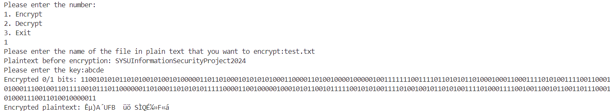 

- 解密：

  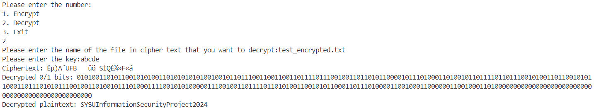

